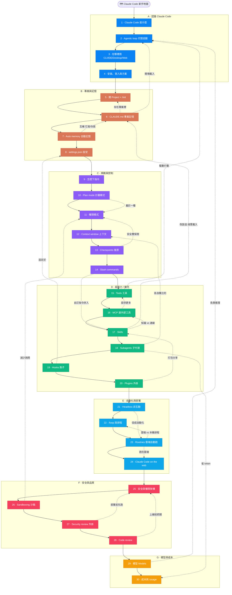

# Claude Code 新手知識地圖

> 一張圖看懂「從零開始用 Claude Code 做出一個會自動跑的自動化」要懂哪些名詞、彼此怎麼互相作用。
> 所有定義皆對照 **Anthropic 官方文件**(`code.claude.com/docs`,2026-06 版)。資料單一來源:[`tree.ts`](./tree.ts)。

## 怎麼看這張地圖

- **學習順序**:節點編號 **1 → 30** 就是建議的學習順序,也是每集影片的集數。看一眼就知道「我學過哪些、現在在哪、下一步學什麼」。
- **7 大類顏色**:A 認識 · B 專案與記憶 · C 規劃與控制 · D 超能力/擴充 · E 自動化與部署 · F 安全與品質 · G 模型與成本。
- **實線**=學習主線(照號碼走);**虛線+文字**=跨分支的「互相作用」關係。

## 樹狀圖

## 節點定義(對照官方)

### A · 認識 Claude Code
| # | 名詞 | 一句話定義 | 來源 |
|---|---|---|---|
| 1 | **Claude Code 是什麼** | 一個 agentic coding 工具:會讀專案、改檔案、跑指令、串接開發工具;可在終端機、IDE、桌面 App、瀏覽器使用。 | [overview](https://code.claude.com/docs/en/overview) |
| 2 | **Agentic loop 代理迴圈** | 三階段循環:收集情境 → 採取行動 → 驗證結果,由模型推理、工具動作。 | [how-claude-code-works](https://code.claude.com/docs/en/how-claude-code-works) |
| 3 | **在哪裡用** | 同一引擎可在 CLI、VS Code/JetBrains 擴充、桌面 App、claude.ai/code 用;CLAUDE.md、設定、MCP 跨介面共用。 | [overview#everywhere](https://code.claude.com/docs/en/overview#use-claude-code-everywhere) |
| 4 | **安裝、登入與方案** | 一行指令安裝、登入 Anthropic 帳號;Pro(年付約 US$17/月)起含 Claude Code,Max(US$100/月起)用量更多,Free 不含。 | [setup](https://code.claude.com/docs/en/setup) · [pricing](https://claude.com/pricing) |

### B · 專案與記憶
| # | 名詞 | 一句話定義 | 來源 |
|---|---|---|---|
| 5 | **開 Project + /init** | Claude Code 在你開的資料夾(專案)內工作;`/init` 會分析程式碼並生成起始 CLAUDE.md。 | [quickstart](https://code.claude.com/docs/en/quickstart) |
| 6 | **CLAUDE.md 專案記憶** | 放在專案根目錄的 markdown,每次開場都讀;寫慣例、build 指令、「永遠要做 X」等持久指令。 | [memory](https://code.claude.com/docs/en/memory) |
| 7 | **Auto memory 自動記憶** | Claude 自己邊做邊記的筆記(存 MEMORY.md),與你寫的 CLAUDE.md 互補。 | [memory#auto-memory](https://code.claude.com/docs/en/memory#auto-memory) |
| 8 | **settings.json 設定** | 設定檔,分使用者/專案/組織層級;控制權限規則、環境變數、hooks、模型。 | [settings](https://code.claude.com/docs/en/settings) |

### C · 規劃與控制
| # | 名詞 | 一句話定義 | 來源 |
|---|---|---|---|
| 9 | **怎麼下指令** | 講具體 + 給可驗證目標(測試/預期輸出/截圖);複雜任務先探索再實作。 | [best-practices](https://code.claude.com/docs/en/best-practices) |
| 10 | **Plan mode 計畫模式** | 讓 Claude 先探索、提計畫但不動原始碼,你審完再放行(Shift+Tab 切換)。 | [permission-modes](https://code.claude.com/docs/en/permission-modes) |
| 11 | **權限模式** | Shift+Tab 切 Default / Auto-accept edits / Plan / Auto;bypassPermissions 跳過所有確認(慎用)。 | [permissions](https://code.claude.com/docs/en/permissions) |
| 12 | **Context window 上下文** | Claude 一次能記住的內容;快滿會自動 compaction,用 `/context` 看用量、`/compact`、`/clear` 整理。 | [context-window](https://code.claude.com/docs/en/context-window) |
| 13 | **Checkpoints 復原** | 每次改檔前快照,按兩下 Esc 倒回;session 本地、與 git 分開,只涵蓋檔案。 | [checkpoints](https://code.claude.com/docs/en/how-claude-code-works#undo-changes-with-checkpoints) |
| 14 | **Slash commands** | `/` 開頭指令操控 session(/init、/model、/clear、/compact、/agents);自訂指令已併入 skills。 | [commands](https://code.claude.com/docs/en/commands) |

### D · 超能力 / 擴充
| # | 名詞 | 一句話定義 | 來源 |
|---|---|---|---|
| 15 | **Tools 工具** | 讓 Claude 能「動作」的能力,內建五類:檔案操作、搜尋、執行、上網、程式碼智慧。 | [tools](https://code.claude.com/docs/en/how-claude-code-works#tools) |
| 16 | **MCP 連外部工具** | Model Context Protocol,連 AI 與外部工具/資料的開放標準;接上後可直接讀寫 Slack、Jira、DB 等。 | [mcp](https://code.claude.com/docs/en/mcp) |
| 17 | **Skills(Agent Skills)** | 寫 SKILL.md 把可重複流程/知識打包,Claude 需要時才動態載入(或 /名稱 直接叫)。 | [skills](https://code.claude.com/docs/en/skills) |
| 18 | **Subagents 子代理** | 專責特定任務的子助手,有獨立 context、自訂提示與工具;隔離雜訊、只回主對話摘要。 | [sub-agents](https://code.claude.com/docs/en/sub-agents) |
| 19 | **Hooks 鉤子** | 在生命週期特定時點自動執行的 shell 指令(設在 settings),確保某動作「一定發生」。 | [hooks-guide](https://code.claude.com/docs/en/hooks-guide) |
| 20 | **Plugins 外掛** | 把 skills/subagents/hooks/MCP 打包成可分享單位,透過 marketplace 安裝給團隊。 | [plugins](https://code.claude.com/docs/en/plugins) |

### E · 自動化與部署
| # | 名詞 | 一句話定義 | 來源 |
|---|---|---|---|
| 21 | **Headless 非互動模式** | `claude -p` 不開互動介面跑單一任務,可 pipe 資料、塞進 build/CI、取得結構化輸出。 | [headless](https://code.claude.com/docs/en/headless) |
| 22 | **/loop 與排程** | `/loop` 讓提示在 CLI session 內按間隔重複跑(輪詢);也能設一次性提醒。 | [scheduled-tasks](https://code.claude.com/docs/en/scheduled-tasks) |
| 23 | **Routines 雲端自動跑** | 把提示+repo+連接器存成設定,跑在 Anthropic 雲端(關機也跑);排程/API/GitHub 觸發,CLI 用 `/schedule`。 | [routines](https://code.claude.com/docs/en/routines) |
| 24 | **Claude Code on the web** | 在瀏覽器跑、免本機環境;每個 session 跑在隔離雲端 VM,適合長任務與沒在本機的 repo。 | [claude-code-on-the-web](https://code.claude.com/docs/en/claude-code-on-the-web) |

### F · 安全與品質
| # | 名詞 | 一句話定義 | 來源 |
|---|---|---|---|
| 25 | **安全與權限架構** | 預設唯讀、要動手才請求授權;內建防 prompt injection、寫入只限工作資料夾;最終你仍要審核。 | [security](https://code.claude.com/docs/en/security) |
| 26 | **Sandboxing 沙箱** | `/sandbox` 對 Bash 做檔案/網路隔離,劃出可自主工作範圍、同時減少權限詢問。 | [sandboxing](https://code.claude.com/docs/en/sandboxing) |
| 27 | **Security review 外掛** | 官方外掛,讓 Claude 在 session 中自動審查並修正自己改動造成的漏洞。 | [security-guidance](https://code.claude.com/docs/en/security-guidance) |
| 28 | **Code review / ultrareview** | PR 上自動跑程式碼審查並標嚴重度;ultrareview 在雲端做更深入的多代理審查。 | [code-review](https://code.claude.com/docs/en/code-review) |

### G · 模型與成本
| # | 名詞 | 一句話定義 | 來源 |
|---|---|---|---|
| 29 | **模型 Models** | `/model` 切換:sonnet(Sonnet 4.6 日常)、opus(Opus 4.8 複雜推理)、haiku(快省)、fable(Fable 5 最難最長);opusplan 規劃用 Opus、執行切 Sonnet。 | [model-config](https://code.claude.com/docs/en/model-config) |
| 30 | **成本與 /usage** | `/usage` 看用量花費;省 token:管理 context、挑對模型、指令移到 skills、雜活交 subagents。 | [costs](https://code.claude.com/docs/en/costs) |

## 跨分支關係(互相作用)

| 從 | 關係 | 到 |
|---|---|---|
| 6 CLAUDE.md | 存在專案裡 | 5 Project |
| 7 Auto memory | 互補(它寫 / 你寫) | 6 CLAUDE.md |
| 6 CLAUDE.md | 開場載入 | 2 Agentic loop |
| 19 Hooks | 設定於 | 8 settings.json |
| 17 Skills | 改放這(按需載入) | 6 CLAUDE.md |
| 17 Skills | 知識 vs 連線 | 16 MCP |
| 14 Slash commands | 自訂指令併入 | 17 Skills |
| 16 MCP | 提供更多 | 15 Tools |
| 15 Tools | 驅動行動 | 2 Agentic loop |
| 29 Models | 負責推理 | 2 Agentic loop |
| 18 Subagents | 各自獨立的 | 12 Context window |
| 18 Subagents | 省 token | 30 成本 |
| 10 Plan mode | 屬於一種 | 11 權限模式 |
| 13 Checkpoints | 安全雙保險 | 11 權限模式 |
| 20 Plugins | 打包分享 | 17 Skills |
| 21 Headless | 促成自動化 | 23 Routines |
| 23 Routines | 跑在雲端 | 24 web |
| 23 Routines | 雲端 vs 本機排程 | 22 /loop |
| 27 Security review | 部署前先跑 | 25 安全 |
| 28 Code review | 上線前把關 | 25 安全 |
| 26 Sandboxing | 減少詢問 | 11 權限模式 |

## 全部來源(逐一核實清單)

- overview — https://code.claude.com/docs/en/overview
- how-claude-code-works — https://code.claude.com/docs/en/how-claude-code-works
- setup — https://code.claude.com/docs/en/setup
- pricing — https://claude.com/pricing
- quickstart — https://code.claude.com/docs/en/quickstart
- memory — https://code.claude.com/docs/en/memory
- settings — https://code.claude.com/docs/en/settings
- best-practices — https://code.claude.com/docs/en/best-practices
- permission-modes — https://code.claude.com/docs/en/permission-modes
- permissions — https://code.claude.com/docs/en/permissions
- context-window — https://code.claude.com/docs/en/context-window
- commands — https://code.claude.com/docs/en/commands
- mcp — https://code.claude.com/docs/en/mcp
- skills — https://code.claude.com/docs/en/skills
- sub-agents — https://code.claude.com/docs/en/sub-agents
- hooks-guide — https://code.claude.com/docs/en/hooks-guide
- plugins — https://code.claude.com/docs/en/plugins
- headless — https://code.claude.com/docs/en/headless
- scheduled-tasks — https://code.claude.com/docs/en/scheduled-tasks
- routines — https://code.claude.com/docs/en/routines
- claude-code-on-the-web — https://code.claude.com/docs/en/claude-code-on-the-web
- security — https://code.claude.com/docs/en/security
- sandboxing — https://code.claude.com/docs/en/sandboxing
- security-guidance — https://code.claude.com/docs/en/security-guidance
- code-review — https://code.claude.com/docs/en/code-review
- model-config — https://code.claude.com/docs/en/model-config
- costs — https://code.claude.com/docs/en/costs
